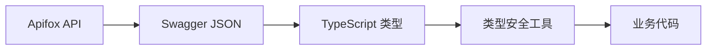

# TypeScript 类型安全工具

@shixinde/apifox-swagger 提供了强大的 TypeScript 类型安全工具，让你可以在编译时就发现 API 调用错误，享受完整的类型提示和自动补全。

## 核心概念

### 类型生成流程

1. **Swagger 文档** → 2. **TypeScript 类型定义** → 3. **类型安全的 API 工具**



### 核心类型

- **`paths`**: 从 Swagger 文档生成的所有 API 路径类型
- **`MakeURL<TPaths, U, M>`**: 完整的 API 信息类型
- **`MakeRequest<TPaths, U, M>`**: 请求参数类型
- **`MakeResponse<TPaths, U, M>`**: 响应数据类型
- **`makeURL()`**: 运行时 URL 构建函数

## 快速开始

### 1. 生成类型文件

```bash
# 导出 API 文档并生成类型
apifox-swagger --projectId 266643 --outdir ./src/types
```

生成的文件结构：
```
src/types/
└── swagger/
    ├── all.json    # Swagger JSON 文档
    └── all.ts      # TypeScript 类型定义
```

### 2. 基本使用

```typescript
// 1. 导入生成的 paths 类型
import type { paths } from './types/swagger/all';

// 2. 导入类型工具
import { 
  makeURL, 
  type MakeURL, 
  type MakeRequest, 
  type MakeResponse 
} from '@shixinde/apifox-swagger/types';

// 3. 定义 API 类型
type UserLoginAPI = MakeURL<paths, '/api/user/login', 'post'>;

// 4. 提取具体类型
type LoginRequest = UserLoginAPI['jsonData'];     // 请求体类型
type LoginResponse = UserLoginAPI['responseData']; // 响应体类型

// 5. 创建类型安全的 URL
const loginUrl = makeURL<paths, '/api/user/login', 'post'>('/api/user/login', 'post');
```

## 详细使用指南

### 1. 类型定义

#### 基本 API 类型定义

```typescript
import type { paths } from './types/swagger/all';
import { type MakeURL } from '@shixinde/apifox-swagger/types';

// 用户相关 API
type UserLoginAPI = MakeURL<paths, '/api/user/login', 'post'>;
type UserProfileAPI = MakeURL<paths, '/api/user/profile', 'get'>;
type UserUpdateAPI = MakeURL<paths, '/api/user/profile', 'put'>;

// 订单相关 API
type OrderListAPI = MakeURL<paths, '/api/order/list', 'get'>;
type OrderCreateAPI = MakeURL<paths, '/api/order/create', 'post'>;
type OrderDetailAPI = MakeURL<paths, '/api/order/{id}', 'get'>;
```

#### 提取具体类型

```typescript
// 从 API 类型中提取具体的请求和响应类型
type LoginRequest = UserLoginAPI['jsonData'];
type LoginResponse = UserLoginAPI['responseData'];

type OrderListQuery = OrderListAPI['query'];
type OrderListResponse = OrderListAPI['responseData'];

type OrderDetailParams = OrderDetailAPI['pathParams'];
type OrderDetailResponse = OrderDetailAPI['responseData'];
```

### 2. 运行时 URL 构建

#### 基本用法

```typescript
import { makeURL } from '@shixinde/apifox-swagger/types';

// 创建类型安全的 URL
const loginUrl = makeURL<paths, '/api/user/login', 'post'>('/api/user/login', 'post');
const profileUrl = makeURL<paths, '/api/user/profile', 'get'>('/api/user/profile', 'get');
const orderDetailUrl = makeURL<paths, '/api/order/{id}', 'get'>('/api/order/{id}', 'get');

// loginUrl 的类型是 readonly ['/api/user/login', 'post']
console.log(loginUrl); // ['/api/user/login', 'post']
```

#### 动态 URL 构建

```typescript
// 带路径参数的 URL
function buildOrderDetailUrl(orderId: string) {
  const [path, method] = makeURL<paths, '/api/order/{id}', 'get'>('/api/order/{id}', 'get');
  return path.replace('{id}', orderId);
}

const url = buildOrderDetailUrl('12345'); // '/api/order/12345'
```

### 3. 创建类型安全的 API 客户端

#### 基础 API 客户端

```typescript
import type { paths } from './types/swagger/all';
import { 
  type MakeRequest, 
  type MakeResponse, 
  type InferMethodFromPaths 
} from '@shixinde/apifox-swagger/types';

// 通用 API 调用函数
async function apiCall<
  U extends keyof paths,
  M extends InferMethodFromPaths<paths, U>
>(
  url: U,
  method: M,
  data?: MakeRequest<paths, U, M>
): Promise<MakeResponse<paths, U, M>> {
  const baseURL = 'https://api.example.com';
  
  // 构建请求 URL
  let requestUrl = `${baseURL}${url}`;
  
  // 处理路径参数
  if (data?.pathParams) {
    Object.entries(data.pathParams).forEach(([key, value]) => {
      requestUrl = requestUrl.replace(`{${key}}`, String(value));
    });
  }
  
  // 处理查询参数
  if (data?.query) {
    const searchParams = new URLSearchParams();
    Object.entries(data.query).forEach(([key, value]) => {
      if (value !== undefined) {
        searchParams.append(key, String(value));
      }
    });
    requestUrl += `?${searchParams.toString()}`;
  }
  
  // 构建请求选项
  const options: RequestInit = {
    method: method as string,
    headers: {
      'Content-Type': 'application/json',
      'Authorization': `Bearer ${getToken()}`
    }
  };
  
  // 处理请求体
  if (data?.jsonData) {
    options.body = JSON.stringify(data.jsonData);
  } else if (data?.formData) {
    const formData = new FormData();
    Object.entries(data.formData).forEach(([key, value]) => {
      formData.append(key, value as string | Blob);
    });
    options.body = formData;
    delete (options.headers as any)['Content-Type']; // 让浏览器自动设置
  }
  
  const response = await fetch(requestUrl, options);
  
  if (!response.ok) {
    throw new Error(`HTTP ${response.status}: ${response.statusText}`);
  }
  
  return response.json();
}

// 获取认证令牌的辅助函数
function getToken(): string {
  return localStorage.getItem('auth_token') || '';
}
```

#### 使用示例

```typescript
// 用户登录
async function login(username: string, password: string) {
  const result = await apiCall('/api/user/login', 'post', {
    jsonData: {
      username,
      password
    }
  });
  
  // result 的类型会被自动推断为 LoginResponse
  localStorage.setItem('auth_token', result.token);
  return result.user;
}

// 获取用户资料
async function getUserProfile() {
  const result = await apiCall('/api/user/profile', 'get');
  
  // result 的类型会被自动推断为 UserProfileResponse
  return result.data;
}

// 获取订单列表
async function getOrderList(page: number = 1, size: number = 10) {
  const result = await apiCall('/api/order/list', 'get', {
    query: {
      page,
      size
    }
  });
  
  // result 的类型会被自动推断为 OrderListResponse
  return result.data;
}

// 获取订单详情
async function getOrderDetail(orderId: string) {
  const result = await apiCall('/api/order/{id}', 'get', {
    pathParams: {
      id: orderId
    }
  });
  
  // result 的类型会被自动推断为 OrderDetailResponse
  return result.data;
}

// 创建订单
async function createOrder(orderData: any) {
  const result = await apiCall('/api/order/create', 'post', {
    jsonData: orderData
  });
  
  return result.data;
}
```

### 4. React Hook 集成

#### 通用 API Hook

```typescript
import { useState, useEffect, useCallback } from 'react';
import type { paths } from './types/swagger/all';
import { 
  type MakeRequest, 
  type MakeResponse, 
  type InferMethodFromPaths 
} from '@shixinde/apifox-swagger/types';

// API 状态类型
interface APIState<T> {
  data: T | null;
  loading: boolean;
  error: Error | null;
}

// 通用 API Hook
function useAPI<
  U extends keyof paths,
  M extends InferMethodFromPaths<paths, U>
>(
  url: U,
  method: M,
  requestData?: MakeRequest<paths, U, M>,
  options?: {
    immediate?: boolean;
    deps?: any[];
  }
): APIState<MakeResponse<paths, U, M>> & {
  refetch: () => Promise<void>;
} {
  const [state, setState] = useState<APIState<MakeResponse<paths, U, M>>>({
    data: null,
    loading: false,
    error: null
  });
  
  const fetchData = useCallback(async () => {
    setState(prev => ({ ...prev, loading: true, error: null }));
    
    try {
      const result = await apiCall(url, method, requestData);
      setState({ data: result, loading: false, error: null });
    } catch (error) {
      setState({ data: null, loading: false, error: error as Error });
    }
  }, [url, method, JSON.stringify(requestData)]);
  
  useEffect(() => {
    if (options?.immediate !== false) {
      fetchData();
    }
  }, options?.deps || [fetchData]);
  
  return {
    ...state,
    refetch: fetchData
  };
}

// 专用 Hook 示例
function useUserProfile() {
  return useAPI('/api/user/profile', 'get');
}

function useOrderList(page: number, size: number) {
  return useAPI('/api/order/list', 'get', {
    query: { page, size }
  }, {
    deps: [page, size]
  });
}

function useOrderDetail(orderId: string) {
  return useAPI('/api/order/{id}', 'get', {
    pathParams: { id: orderId }
  }, {
    deps: [orderId]
  });
}
```

#### React 组件使用示例

```typescript
import React from 'react';

// 用户资料组件
function UserProfile() {
  const { data: user, loading, error, refetch } = useUserProfile();
  
  if (loading) return <div>加载中...</div>;
  if (error) return <div>错误: {error.message}</div>;
  if (!user) return <div>未找到用户信息</div>;
  
  return (
    <div>
      <h1>{user.name}</h1>
      <p>邮箱: {user.email}</p>
      <button onClick={refetch}>刷新</button>
    </div>
  );
}

// 订单列表组件
function OrderList() {
  const [page, setPage] = React.useState(1);
  const { data: orders, loading, error } = useOrderList(page, 10);
  
  if (loading) return <div>加载中...</div>;
  if (error) return <div>错误: {error.message}</div>;
  
  return (
    <div>
      <h1>订单列表</h1>
      {orders?.data.map(order => (
        <div key={order.id}>
          <h3>订单 #{order.id}</h3>
          <p>状态: {order.status}</p>
          <p>金额: ¥{order.amount}</p>
        </div>
      ))}
      
      <div>
        <button 
          onClick={() => setPage(p => Math.max(1, p - 1))}
          disabled={page <= 1}
        >
          上一页
        </button>
        <span>第 {page} 页</span>
        <button 
          onClick={() => setPage(p => p + 1)}
          disabled={!orders?.hasNext}
        >
          下一页
        </button>
      </div>
    </div>
  );
}

// 订单详情组件
function OrderDetail({ orderId }: { orderId: string }) {
  const { data: order, loading, error } = useOrderDetail(orderId);
  
  if (loading) return <div>加载中...</div>;
  if (error) return <div>错误: {error.message}</div>;
  if (!order) return <div>未找到订单</div>;
  
  return (
    <div>
      <h1>订单详情</h1>
      <p>订单号: {order.id}</p>
      <p>状态: {order.status}</p>
      <p>金额: ¥{order.amount}</p>
      <p>创建时间: {order.createdAt}</p>
      
      <h2>订单项目</h2>
      {order.items.map(item => (
        <div key={item.id}>
          <p>{item.name} x {item.quantity}</p>
          <p>¥{item.price}</p>
        </div>
      ))}
    </div>
  );
}
```

### 5. 多模块类型管理

#### 统一类型导入（推荐）

```typescript
// src/types/api.ts - 统一的类型导入文件
import type { paths as UserPaths } from './swagger/user';
import type { paths as OrderPaths } from './swagger/order';
import type { paths as ProductPaths } from './swagger/product';

// 合并所有 API 路径类型
export type AllPaths = UserPaths & OrderPaths & ProductPaths;

// 重新导出工具类型
export { 
  makeURL, 
  type MakeURL, 
  type MakeRequest, 
  type MakeResponse,
  type InferMethodFromPaths 
} from '@shixinde/apifox-swagger/types';

// 导出具体的业务类型
export type UserLoginAPI = MakeURL<AllPaths, '/api/user/login', 'post'>;
export type UserProfileAPI = MakeURL<AllPaths, '/api/user/profile', 'get'>;
export type OrderListAPI = MakeURL<AllPaths, '/api/order/list', 'get'>;
export type OrderCreateAPI = MakeURL<AllPaths, '/api/order/create', 'post'>;
export type ProductListAPI = MakeURL<AllPaths, '/api/product/list', 'get'>;
```

#### 业务代码使用

```typescript
// 在业务代码中使用统一的类型
import { makeURL, type AllPaths, type MakeURL } from '../types/api';

// 现在可以直接使用所有 API 路径
const userLogin = makeURL<AllPaths, '/api/user/login', 'post'>('/api/user/login', 'post');
const orderCreate = makeURL<AllPaths, '/api/order/create', 'post'>('/api/order/create', 'post');
const productList = makeURL<AllPaths, '/api/product/list', 'get'>('/api/product/list', 'get');

// 类型推断也会正常工作
type UserLoginAPI = MakeURL<AllPaths, '/api/user/login', 'post'>;
type OrderCreateAPI = MakeURL<AllPaths, '/api/order/create', 'post'>;
type ProductListAPI = MakeURL<AllPaths, '/api/product/list', 'get'>;
```

### 6. 高级用法

#### 条件类型和类型守卫

```typescript
// 检查 API 是否需要认证
type RequiresAuth<T> = T extends { headers: { Authorization: string } } ? true : false;

// 检查 API 是否有路径参数
type HasPathParams<T> = T extends { pathParams: any } ? true : false;

// 类型守卫函数
function isAuthRequired<U extends keyof paths, M extends InferMethodFromPaths<paths, U>>(
  url: U,
  method: M
): boolean {
  // 这里可以根据实际需求实现逻辑
  return !url.includes('/public/');
}

// 使用示例
if (isAuthRequired('/api/user/profile', 'get')) {
  // 需要认证的 API 调用
  console.log('需要认证');
}
```

#### 自定义类型工具

```typescript
// 提取所有 GET 请求的路径
type GetPaths<T> = {
  [K in keyof T]: T[K] extends { get: any } ? K : never;
}[keyof T];

// 提取所有 POST 请求的路径
type PostPaths<T> = {
  [K in keyof T]: T[K] extends { post: any } ? K : never;
}[keyof T];

// 使用示例
type AllGetPaths = GetPaths<paths>; // 所有 GET 请求的路径
type AllPostPaths = PostPaths<paths>; // 所有 POST 请求的路径

// 创建只支持 GET 请求的 API 客户端
async function getRequest<U extends GetPaths<paths>>(
  url: U,
  data?: MakeRequest<paths, U, 'get'>
): Promise<MakeResponse<paths, U, 'get'>> {
  return apiCall(url, 'get', data);
}
```

## 常见问题和解决方案

### 1. "类型不能赋给类型 never 的参数" 错误

**问题**：使用 `makeURL` 时出现类型错误。

```typescript
// ❌ 错误的用法
const url = makeURL('/api/user/login', 'post'); // 类型错误
```

**解决方案**：

```typescript
// ✅ 正确的用法
import type { paths } from './types/swagger/all';

const url = makeURL<paths, '/api/user/login', 'post'>('/api/user/login', 'post');
```

**检查清单**：
1. 是否正确导入了 `paths` 类型
2. 路径是否存在于 Swagger 文档中
3. HTTP 方法是否正确
4. 是否已经运行了代码生成命令

### 2. 类型推断错误

**问题**：从 `makeURL` 返回值推断类型。

```typescript
// ❌ 错误的类型推断
type API = MakeURL<paths, typeof makeURL('/api/user/login', 'post')[0], typeof makeURL('/api/user/login', 'post')[1]>;
```

**解决方案**：

```typescript
// ✅ 正确的类型推断
type API = MakeURL<paths, '/api/user/login', 'post'>;

// 如果需要运行时 URL 构建
const url = makeURL<paths, '/api/user/login', 'post'>('/api/user/login', 'post');
```

### 3. 路径参数类型问题

**问题**：路径参数类型不匹配。

```typescript
// 假设 API 路径是 '/api/user/{id}'
const result = await apiCall('/api/user/{id}', 'get', {
  pathParams: {
    id: 123 // ❌ 可能需要字符串类型
  }
});
```

**解决方案**：

```typescript
// ✅ 检查生成的类型定义
type UserDetailAPI = MakeURL<paths, '/api/user/{id}', 'get'>;
type PathParams = UserDetailAPI['pathParams']; // 查看 id 的实际类型

const result = await apiCall('/api/user/{id}', 'get', {
  pathParams: {
    id: '123' // 使用正确的类型
  }
});
```

## 最佳实践

### 1. 项目结构

```
src/
├── types/
│   ├── api.ts              # 统一的类型导入
│   └── swagger/
│       ├── user.ts         # 用户模块类型
│       ├── order.ts        # 订单模块类型
│       └── product.ts      # 产品模块类型
├── api/
│   ├── client.ts           # API 客户端
│   ├── hooks.ts            # React Hooks
│   └── types.ts            # API 相关类型
└── components/
    ├── UserProfile.tsx
    ├── OrderList.tsx
    └── ProductList.tsx
```

### 2. 类型命名约定

```typescript
// API 类型命名：[模块][操作]API
type UserLoginAPI = MakeURL<paths, '/api/user/login', 'post'>;
type UserProfileAPI = MakeURL<paths, '/api/user/profile', 'get'>;
type OrderCreateAPI = MakeURL<paths, '/api/order/create', 'post'>;

// 请求/响应类型命名：[模块][操作][Request|Response]
type UserLoginRequest = UserLoginAPI['jsonData'];
type UserLoginResponse = UserLoginAPI['responseData'];

// Hook 命名：use[模块][操作]
function useUserLogin() { /* ... */ }
function useOrderList() { /* ... */ }
```

### 3. 错误处理

```typescript
// 统一的错误类型
interface APIError {
  code: string;
  message: string;
  details?: any;
}

// 错误处理装饰器
function withErrorHandling<T extends (...args: any[]) => Promise<any>>(
  fn: T
): T {
  return (async (...args: any[]) => {
    try {
      return await fn(...args);
    } catch (error) {
      // 统一错误处理逻辑
      console.error('API 调用失败:', error);
      throw error;
    }
  }) as T;
}

// 使用示例
const safeApiCall = withErrorHandling(apiCall);
```

### 4. 自动更新

```json
{
  "scripts": {
    "dev": "npm run export-api && vite",
    "build": "npm run export-api && vite build",
    "export-api": "apifox-swagger --projectId 266643 --outdir ./src/types",
    "watch-api": "nodemon --watch apifox.config.js --exec \"npm run export-api\""
  }
}
```

## 下一步

- [配置文件详解](./configuration.md)
- [故障排除指南](./troubleshooting.md)
- [编程接口使用](./api.md)
- [命令行工具使用](./cli.md)